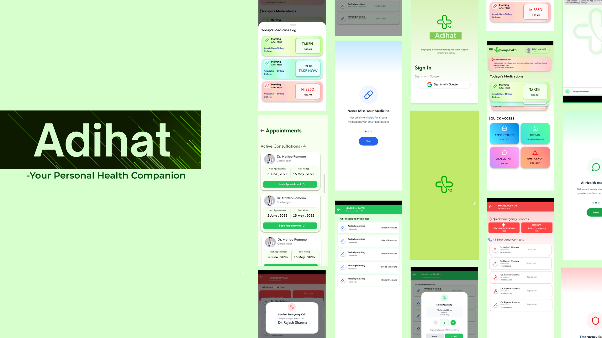

# 💙 Dr. Adihat

**Dr. Adihat** is a Flutter-based mobile app designed for doctors and healthcare professionals to instantly access a patient's complete medical history using a unique code generated from the **Adihat Patient App**. It securely fetches critical information like diseases, prescribed medicines, and emergency contacts from Firestore, enabling fast and informed medical decisions in clinics, hospitals, or emergency situations.

**[Download APK](https://drive.google.com/file/d/1TzcXcaxLc8j_kwVvfKgnZBAKTaPA2VDL/view?usp=drive_link)**

## 📱 App Preview

  

🔗 **Main GitHub Repository:**()

## 👨‍💻 Meet Team Nadan Parinde

A team of passionate developers from **SATI Vidisha**, committed to transforming how healthcare is accessed, managed, and shared.

| Name                | Skills                          | Institution   | LinkedIn                                                           |
| ------------------- | ------------------------------- | ------------- | ------------------------------------------------------------------ |
| **Pradhum Mandil**  | App Dev · Flutter · Kotlin · C++| SATI VIDISHA   | [LinkedIn](www.linkedin.com/in/pradhum-mandil-b69b66318)              |
| **Hitarth Mishra**  | Founder  · JAVA   · CP             | SATI VIDISHA   | [LinkedIn]()             |
| **Aadi Shrivastava**| Marketing · Java                 | SATI VIDISHA   | [LinkedIn](https://www.linkedin.com/in/aadi-shrivastava-223990352/) |
| **Daksha Pande**    | AI/ML · Python · NLP · UI/UX    | SATI VIDISHA   | [LinkedIn](https://www.linkedin.com/in/daksha-pande-840125325/)|

---
